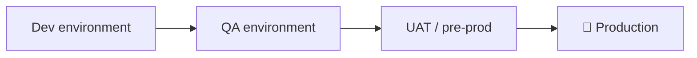
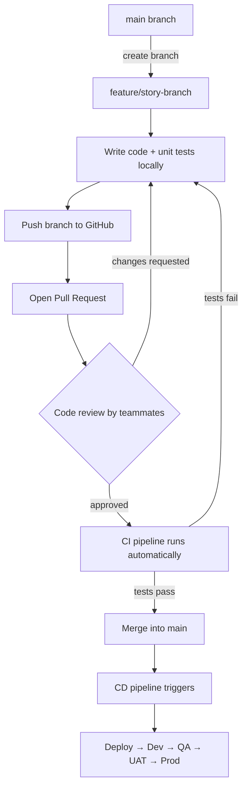
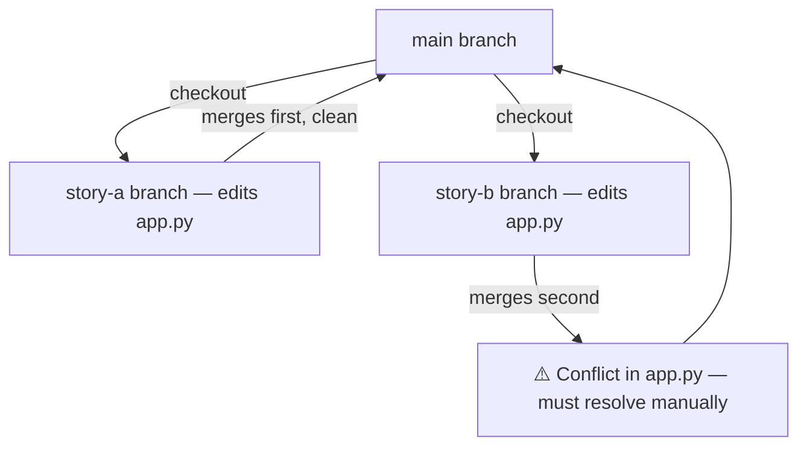

# 🔧 GitHub Actions & CI/CD — Interactive Lesson Guide

A self-paced guide for learning CI/CD with GitHub Actions. Built for active learning, not passive reading: check boxes as you go, reveal quiz answers only after you've tried, and run the diagrams through your head before checking the explanation.

---

## 🧭 How to use this file

- **Diagrams** are written in [Mermaid](https://mermaid.js.org/). They render automatically on GitHub, in VS Code (with the Mermaid extension), and in Obsidian. If your viewer shows raw text instead of a picture, paste the block into the [Mermaid Live Editor](https://mermaid.live).
- **Quizzes** are hidden behind `▶ Reveal answer`. Answer in your head (or out loud) *before* clicking.
- **Checkboxes** track your progress — they're real GitHub-flavored markdown checkboxes, so they stay ticked if you edit this file in an editor that supports them.

---

## 📋 Table of Contents

1. [The Big Three: Git, GitHub & GitHub Actions](#section-1)
2. [CI vs CD](#section-2)
3. [The Full Developer Workflow](#section-3)
4. [Hands-On Build: Your First CI Pipeline](#section-4)
5. [Reading a Workflow YAML Like a Pro](#section-5)
6. [Common Pitfalls & Debugging](#section-6)
7. [Mini Challenge](#section-7)
8. [Cheat Sheet](#section-8)
9. [Final Quiz](#section-9)

*(If your viewer doesn't support these jump-links, use your editor's outline/heading view instead.)*

### ✅ Progress tracker

- [ ] I can explain the difference between Git, GitHub, and GitHub Actions
- [ ] I can explain CI vs CD in one sentence each
- [ ] I can trace a feature from branch → PR → merge → deploy
- [ ] I can read an existing `.yml` workflow file and say what each line does
- [ ] I wrote and pushed a working pipeline myself
- [ ] I completed the mini challenge

---

<a id="section-1"></a>
## 1. The Big Three: Git, GitHub & GitHub Actions

People mix these up constantly. They are three different layers of the same stack.

| Layer | What it actually is | Analogy |
|---|---|---|
| **Git** | A distributed version control system that runs *locally*. Tracks file history, branches, merges, and conflicts. | The save/undo system for your whole codebase |
| **GitHub** | A hosting platform for Git repositories. Where your team's code lives remotely so people can collaborate. | The shared drive / cloud home for your repo |
| **GitHub Actions** | A CI/CD automation tool *built into* GitHub. Runs scripts automatically when something happens in your repo (a push, a PR, a schedule). | The robot that watches your repo and reacts to events |

You could use Git without GitHub (fully local). You could use GitHub without GitHub Actions (just for hosting/PRs). But you can't use GitHub Actions without GitHub.

> 💡 **Where conflicts get resolved:** when two developers edit the same file in different branches and merge, Git is what flags and resolves the conflict — GitHub just gives you a UI to do it in.

<details>
<summary>▶ Reveal answer — Quick check 1</summary>

**Q: True or False — Git and GitHub are the same thing.**
False. Git is the version-control *tool*. GitHub is a *hosting platform* built around Git. You could swap GitHub for GitLab or Bitbucket and still be using Git underneath.

**Q: Which of the three would you use to resolve a merge conflict, and where does it physically happen?**
Git does the conflict resolution mechanics; you typically trigger and view it through GitHub's pull request interface, but the actual three-way diff/merge logic is Git's job.
</details>

---

<a id="section-2"></a>
## 2. CI vs CD

**Continuous Integration (CI):** every time someone pushes code or opens a pull request, an automated process builds the project and runs the test suite — *before* the change is allowed to merge. Goal: catch breakage early, from anyone's commit.

**Continuous Deployment/Delivery (CD):** once code passes CI and merges, it's automatically pushed forward into one or more real environments (dev → QA → UAT → production) instead of someone manually copying files onto a server.



Each arrow is a *gate*: a human or automated test suite signs off before the change moves to the next box. CD is what makes those arrows automatic instead of "someone SSHs in and copies files."

<details>
<summary>▶ Reveal answer — Quick check 2</summary>

**Scenario:** A workflow runs unit tests on every push. A second workflow, triggered only after a merge to `main`, automatically deploys the app to a staging server.

Which part is CI and which is CD?
- Running tests on every push = **CI** (verifying changes don't break anything).
- Auto-deploying after merge = **CD** (shipping the verified code somewhere real, with no manual step).
</details>

---

<a id="section-3"></a>
## 3. The Full Developer Workflow

This is the loop a feature actually travels through, end to end.



### Why branches exist in the first place

If two developers both edit `app.py` directly on `main`, whoever pushes second can silently overwrite the first person's work. Branches isolate each person's changes until they're reviewed and merged deliberately.



The second merge doesn't fail silently — Git flags the overlapping lines and forces a human to decide how to combine them. That's a feature, not a bug.

### The five workflow stages, as a checklist

- [ ] **Coding** — write code following team style conventions
- [ ] **Version control** — branch, commit, push, resolve conflicts via Git
- [ ] **Code review** — a teammate checks quality/style before merge
- [ ] **Automated testing** — unit, integration, and/or end-to-end tests run without a human triggering them
- [ ] **CI** — every push/PR triggers a build + test cycle automatically
- [ ] **CD** — a successful merge automatically promotes the build toward production

<details>
<summary>▶ Reveal answer — Quick check 3</summary>

**Put these in the correct order:**
`Merge to main` · `Open PR` · `Create feature branch` · `CI pipeline runs` · `Push to remote` · `Write code & tests` · `Code review`

**Answer:**
Create feature branch → Write code & tests → Push to remote → Open PR → Code review → CI pipeline runs → Merge to main
</details>

---

<a id="section-4"></a>
## 4. Hands-On Build: Your First CI Pipeline

You'll build a tiny Python project with two functions, unit tests for them, and a GitHub Actions workflow that runs those tests automatically on every push.

### Step 1 — Project structure

```
my-ci-demo/
├── requirements.txt
├── src/
│   ├── __init__.py
│   └── calculator.py
├── tests/
│   ├── __init__.py
│   └── test_calculator.py
└── .github/
    └── workflows/
        └── python-ci.yml
```

> The `tests/` folder name matters — `pytest` automatically discovers files named `test_*.py` inside it.

### Step 2 — `requirements.txt`

```text
pandas
pytest
```

### Step 3 — `src/calculator.py`

```python
def add(a, b):
    return a + b


def subtract(a, b):
    return a - b
```

### Step 4 — `tests/test_calculator.py`

```python
from src.calculator import add, subtract


def test_add():
    assert add(2, 3) == 5
    assert add(-1, 1) == 0


def test_subtract():
    assert subtract(5, 3) == 2
    assert subtract(3, 3) == 0
```

### Step 5 — `.github/workflows/python-ci.yml`

```yaml
name: Python CI

on:
  push:
    branches: ["main"]
  pull_request:
    branches: ["main"]

jobs:
  test:
    runs-on: ubuntu-latest

    steps:
      - name: Check out the code
        uses: actions/checkout@v4

      - name: Set up Python
        uses: actions/setup-python@v5
        with:
          python-version: "3.11"

      - name: Install dependencies
        run: |
          python -m pip install --upgrade pip
          pip install -r requirements.txt

      - name: Run tests
        run: pytest
```

### Step 6 — Push and watch it run

```bash
git add .
git commit -m "Add calculator + CI pipeline"
git push origin main
```

Go to your repo's **Actions** tab on GitHub — the workflow fires within a few seconds. Click into the run to watch each step (checkout → setup → install → test) execute live in a fresh Ubuntu container.

<details>
<summary>▶ Reveal answer — Checkpoint quiz</summary>

**Q: Your `on:` block only has `push: branches: [main]`. Someone opens a PR from `feature-x` into `main` but hasn't merged yet. Does the workflow run?**

No. `push` only fires on direct pushes/merges into the listed branch. To run on pull requests too, you need a separate `pull_request:` entry under `on:` — which the example above already includes.
</details>

---

<a id="section-5"></a>
## 5. Reading a Workflow YAML Like a Pro

Every workflow file is just nested key-value pairs. Here's what each top-level key controls:

| Key | Purpose |
|---|---|
| `name` | Label shown in the Actions tab — purely cosmetic |
| `on` | The **trigger**: which repo events start this workflow (`push`, `pull_request`, `schedule`, `workflow_dispatch`, etc.) |
| `jobs` | One or more named units of work; each job runs in its own fresh container |
| `runs-on` | Which OS image the job executes in (`ubuntu-latest`, `windows-latest`, `macos-latest`) |
| `steps` | An ordered list of actions executed inside the job, top to bottom |
| `uses` | Runs a pre-built, reusable action (someone else's packaged automation) instead of a raw shell command |
| `with` | Parameters passed into a `uses` action |
| `run` | A raw shell command, executed directly in the container |

<details>
<summary>▶ Why pin action versions like <code>@v4</code> instead of just <code>checkout</code>?</summary>

Actions are versioned the same way packages are. Pinning to `@v4` means your pipeline behaves predictably even if the action's maintainers ship breaking changes in `@v5`. Unpinned or `@main` references can silently change behavior under you.
</details>

<details>
<summary>▶ Why does the job need <code>actions/checkout</code> at all?</summary>

Each job starts in a completely empty container — it has no knowledge of your repository by default. `actions/checkout` is the step that actually clones your code into that container so later steps have files to work with. Skip it, and `pytest` would fail because there's no `tests/` folder to find.
</details>

---

<a id="section-6"></a>
## 6. Common Pitfalls & Debugging

| Symptom | Likely cause |
|---|---|
| "Works on my machine" but fails in CI | A dependency is installed locally but missing from `requirements.txt` |
| `ModuleNotFoundError` for your own package | Missing `__init__.py`, or an import path that assumes a different working directory |
| Workflow never triggers | Branch name in `on:` doesn't match the branch you actually pushed to (`main` vs `master`) |
| Cryptic YAML parsing error | Indentation — YAML is whitespace-sensitive; tabs and spaces don't mix |
| Pipeline "succeeds" but tests didn't actually run | `pytest` couldn't find the `tests/` folder — check you're in the repo root and the folder is named correctly |
| Secrets/API keys exposed in logs | Hardcoded credentials in the workflow file instead of using **GitHub Secrets** (`${{ secrets.MY_KEY }}`) |

---

<a id="section-7"></a>
## 7. Mini Challenge

Extend the pipeline from Section 4 so that:

1. `calculator.py` gains a `multiply(a, b)` function, with a matching test.
2. The workflow tests against **both** Python 3.10 and 3.11 in the same run, instead of just one version.

<details>
<summary>▶ Hint</summary>

For requirement 2, look up GitHub Actions' `strategy.matrix` feature — it lets a single job definition fan out into multiple parallel runs, one per value in a list.
</details>

<details>
<summary>▶ Solution</summary>

```yaml
jobs:
  test:
    runs-on: ubuntu-latest
    strategy:
      matrix:
        python-version: ["3.10", "3.11"]

    steps:
      - uses: actions/checkout@v4

      - name: Set up Python ${{ matrix.python-version }}
        uses: actions/setup-python@v5
        with:
          python-version: ${{ matrix.python-version }}

      - name: Install dependencies
        run: |
          python -m pip install --upgrade pip
          pip install -r requirements.txt

      - name: Run tests
        run: pytest
```

This runs the *entire* job twice in parallel — once per Python version — and both must pass for the workflow to succeed.
</details>

> 💡 **Bonus for data/ML projects:** the exact same pattern applies if your "tests" are model-validation checks (e.g. asserting a model's accuracy stays above a threshold on a held-out set) and your "deploy" step ships a trained model or inference API instead of a web app. CI/CD doesn't care what you're testing or shipping — only that it's automated and gated.

---

<a id="section-8"></a>
## 8. Cheat Sheet

| Term | One-line definition |
|---|---|
| **Git** | Local distributed version control |
| **GitHub** | Remote hosting platform for Git repos |
| **GitHub Actions** | GitHub's built-in CI/CD automation |
| **CI** | Auto build + test on every push/PR |
| **CD** | Auto-deploy after a successful merge |
| **Workflow** | A `.yml` file defining triggers + jobs |
| **Job** | A set of steps run in one fresh container |
| **Step** | One action or shell command inside a job |
| **Runner** | The actual VM/container executing the job (`ubuntu-latest`, etc.) |
| **Action** | A reusable, packaged step (e.g. `actions/checkout`) |
| **Pull Request (PR)** | A request to merge one branch into another, with review |
| **Merge conflict** | Overlapping edits to the same lines that Git can't auto-resolve |

---

<a id="section-9"></a>
## 9. Final Quiz

<details>
<summary>▶ Q1 — True or False: You need GitHub specifically to use Git.</summary>

False. Git works entirely locally and with any remote host (GitLab, Bitbucket, a self-hosted server). GitHub is just one popular hosting option.
</details>

<details>
<summary>▶ Q2 — Fill in the blank: A workflow's trigger conditions live under the top-level key ____.</summary>

`on`
</details>

<details>
<summary>▶ Q3 — Scenario: your CI job installs dependencies but the test step says "no module named pandas." What's the most likely cause?</summary>

`pandas` is missing from `requirements.txt` (or the install step ran before the file was checked out / never ran at all). The container has no memory of your local environment — only what's explicitly installed in that job.
</details>

<details>
<summary>▶ Q4 — Two developers each branch off main and edit the same function in app.py. Who "wins" when both branches merge?</summary>

Neither, automatically — Git flags it as a merge conflict and requires a human to manually decide how the two versions should be combined before the merge can complete.
</details>

<details>
<summary>▶ Q5 — Why run tests in CI at all, if developers already test locally before pushing?</summary>

CI tests run in a clean, consistent environment regardless of what's installed on any individual's machine, and they run on *every* push from *every* contributor — catching the case where someone forgets to test, or where two people's individually-passing changes break each other once combined.
</details>

---

## 🎓 Recap

Git tracks changes → GitHub hosts and lets teams collaborate on them → GitHub Actions watches for events (push, PR, schedule) and automates build/test/deploy in response. CI catches breakage before merge; CD ships verified code onward without a human copying files by hand. The workflow YAML is just: *what triggers this* → *what container runs it* → *what steps happen in order*.
